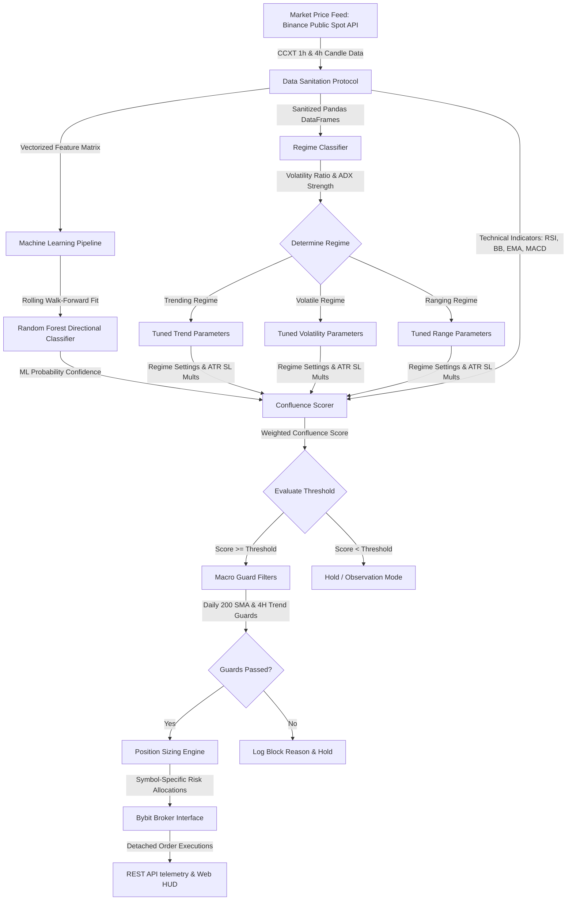

# J.A.R.V.I.S // Quantitative Architecture Specification & Core Flow

This document details the engineering specifications of the J.A.R.V.I.S. hybrid quantitative trading engine. It outlines the indicators, regime classification formulas, walk-forward machine learning pipeline, and sizing execution guards.

---

## 🗺️ 1. Complete System Data & Execution Flow



---

## 📡 2. Data Ingestion & Sanitization

1. **Exchange Ingest (CCXT):** Public Spot REST API provides historical OHLCV data. A 5-stage exponential backoff pipeline prevents rate-limit lockouts.
2. **Sanitation Protocol:** 
   * Drops rows containing NaN data.
   * Discards zero-volume candles (`df[df["volume"] > 0]`) to protect against division-by-zero errors in technical indicators (e.g. Volume Z-scores, ATR calculation).

---

## 📈 3. Market Regime Classifier

The regime classifier categorizes volatility and trend strength to dynamically tune risk parameters:

* **ADX (Average Directional Index):** Evaluated over a 14-period lookback on the 4-hour timeframe to measure trend strength.
* **Volatility Ratio:** 
  $$\text{Volatility Ratio} = \frac{\text{ATR}(14)}{\text{SMA}(\text{ATR}(14), 50)}$$

### Classification Logic:
* **Volatile Regime:** $\text{Volatility Ratio} > 1.5$ and $\text{ADX} < 25$
* **Trending Regime:** $\text{ADX} \ge 25$
* **Ranging Regime:** Default state (Low ADX, low volatility)

---

## 🧠 4. Machine Learning & Walk-Forward Ensemble

To avoid concept drift, the machine learning classifier operates on a rolling walk-forward loop:

```
[--- 2000 Hour Rolling Training Window (~83 days) ---]  [-- 576 Hour Out-of-Sample Test Window (~24 days) --]
|===================================================|  |====================================================|
  (Dynamic Fit & StandardScaler Fit on 8 Features)       (Out-of-sample Signal Classification Inference)
                                                    \___ Slide Window Forward by 576 Hours after Out-of-Sample runs.
```

### Engineered Features ($f_{1}$ to $f_{8}$):
1. **Relative Return:** 1-hour return relative to volatility.
2. **RSI Ratio:** 14-period RSI scaled between 0.0 and 1.0.
3. **SMA Spread:** $\text{SMA}(20) / \text{SMA}(50)$.
4. **Bollinger Bandwidth:** $(\text{Upper} - \text{Lower}) / \text{Middle}$.
5. **Volatility Z-score:** ATR normalization.
6. **Volume Z-score:** Volume Z-score normalized over 20 periods.
7. **Price Position:** Closeness of the price to Bollinger Bands ($0.0 = \text{Lower}$, $1.0 = \text{Upper}$).
8. **Macro Trend Spread:** $\text{EMA}(20, \text{4h}) / \text{EMA}(50, \text{4h})$.

---

## 🔢 5. Multi-Regime Weighted Scoring Engine

Signals must clear the regime's target threshold to trigger execution:

### Signal Scorer Logic Matrix:
* **Trending (Threshold: 3.0):** Prioritizes macro trend direction and MA crosses. Includes minor pullback flags (touching lower band in uptrend).
* **Volatile (Threshold: 3.0):** Prioritizes breakouts beyond the local session highs/lows.
* **Ranging (Threshold: 2.5):** Prioritizes mean reversion (RSI oversold/overbought at outer Bollinger Bands).

### Overlay Super-Filters:
* **ML Confidence Booster:** If ML probability $\ge 0.58$, add `+2.0` points. If $\le 0.42$, subtract `-2.0` points.
* **Volume Expansion Check:** Add `+1.0` point if volume is higher than average and matches the macro trend direction.
